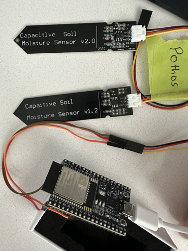

i travel a lot between a few cities. despite making the questionable financial decision to purchase a home in the past few years, i spend anywhere from 30-50% of my time in other cities. as everyone knows when you turn middle aged you're assigned some random hobbies that you get way too invested in as a replacement for regular social interaction. in my case, it's coffee, running, and plants. so I have a modest collection of about 15 plants in my home that unfortunately don't come with me when i travel, which means i need to figure out an automatic watering solution.

up until recently, that solution has been asking a friend to come by and water my plants. this has mostly worked at the expense of straining my relationship with this friend ("how are my plants doing? did you actually water them? THEY'D BETTER NOT BE DEAD") but i decided friendship equity isn't a currency i can trade on forever. i need a truly automatic solution.

so i did what anyone else with a technical background would do: tried to copy someone else's designs. unfortunately in my research, while i found many examples of outdoor automated watering sensor and pumps, indoor examples were hard to come by. especially given my constraints, which i made up mostly at random:
- watering needs to be done based on soil moisture, not scheduled
- leak detection must be integrated to the system
- integrates with home assistant (add home automation to the hobby assignments)
- operates across 15 plants in two zones (12 and 3 respectively)
- isn't ugly

i'm finally at the stage now where enough parts have come in to enable me to start testing and tinkering. i have used heavy AI assistance in research and planning up to this stage. while i have built simple microcontroller systems in the past (i flirted with hifi in my younger days, building headphones amps and speakers, plus some entry level robotics tutorials) and have a general ability to use a soldering iron (i've only given myself second-degree burns once), i know the clankers will outstrip my experience level with ease.

similar to my past forays into building hobby electronics, the primary challenge has not been my middling technical ability. rather, the first issue i'm running into is the reliability of hobbyist parts i've purchased. i bought two batches of explicitly v1.2 capacitive soil moisture sensors. you can see two of these in the image below:

this shouldn't be an issue since v2.0 sensors are schematically compliant with the v1.2 sensors. a drop in replacement. except that while the v1.2 sensor reports 2.2V in air, the v2.0 sensor reports 0.14V. i've yet to test the others. furthermore my dupont wires (originally what i assumed to be the source of the issue) are falling apart, with the plastic housing being broken off about a third of the wires from the get.

for now, i have my one pothos sensor configured to a specified depth with esphome via my esp32 and homeassistant and will move on to to testing the pumps and solenoids next.