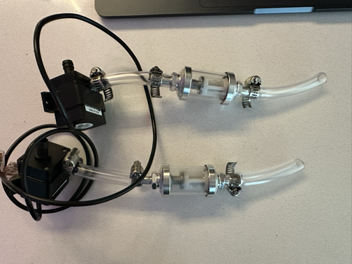
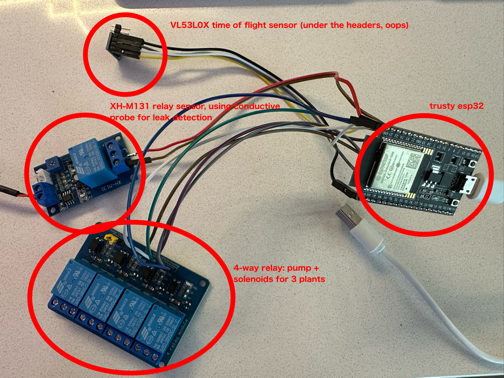

i'm slowly making progress on the automated watering system. the biggest hurdle along the way has been supply chain, and by that I mean me noting buying everything i need in time for when i need it.

the programming is going smoothly. the firmware is dead simple, but more importantly the process by which home assistant will manage operations is straightforward. essentially i've generated a home assistant automation template that does the following:

1. for each zone, read each hygrometer
2. for each hygrometer, check if it's below the plant's calibrated low moisture threshold
3. for any that are below, if there's enough water in the reservoir (measured by a time of flight sensor on the lid of the reservoir) run the water pump and open the appropriate solenoid. if there are multiples, do it in order. water each plant for a few seconds (will calibrate each "sip" once I have the full flow).
4. wait a minute for the moisture to disperse, then check the latest hygrometer reading
5. continue "sipping" until the moisture is above the threshold, or the plant has hit its max "sips per day", which is configured as part of the home assistant automation
6. if at any point there's a leak detected, kill the circuit powering the pump and solenoids, which fail closed

I've tested the pumps independently, and I've tested the moisture-sip-leak-reservoir volume loop with success! now just waiting for the last bits of plumbing and better wire strippers to arrive so i can wire up one of the zones. additionally, one of the sensor relays was busted -- so far i've had 10 broken hygrometers and 1 broken sensor relay. not great, but i guess they are cheap parts after all.

the pumps have filters installed to prevent anything from getting into the solenoids and locking them open (i'm very paranoid about leaks) and will be using opaque tubes to run to the plants to mitigate issues with algal growth. today we have this:

the pumps are relatively standard aquarium pumps (i think? i saw that on some of the listings) and the filters are actually motorcycle fuel line filters that should serve the same purpose here.

the small zone cluster looks like this while testing and calibrating:

the TOF sensor points at the water to measure the distance, this can be used along with a reservoir size measurement to calculate if the water is low. the relay sensor is used to directly interrupt the 12v running through the 4 way relay in case of leaks. and the 4 way relay is used to switch on which solenoid (with helpful little LEDs to identify them) + running the water pump.

all working as expected. next test will be a single plant simulation with actual water flow, once i have the remaining plugs and some better wiring equipment.