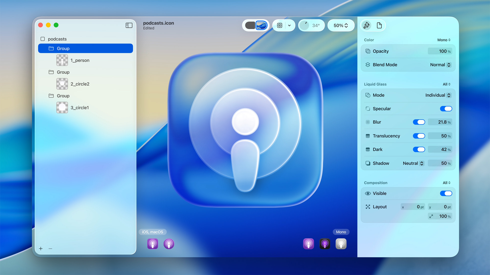

if you don't know what liquid glass is, first of all, congrats. second of all, it's a new design standard in newer apple operating systems. it focuses on making every detail in the operating system look like it's refracted through curved dusty glass. i wish i was joking.

the official press release reads like someone asked claude "write the most pretentious article about the dumbest design changes that were created by one delusional vp in product who needed a portfolio item. if people aren't jerking themselves off over it on linked in, then rewrite it with even more pretense." seriously. why the fuck did apple describe it in the press release like it was a new material or hardware?? ["It’s crafted with a new material called Liquid Glass. This translucent material reflects and refracts its surroundings..."](https://www.apple.com/newsroom/2025/06/apple-introduces-a-delightful-and-elegant-new-software-design/). might as well have said "we've invented a new physics, proved that p=np, and learned to unfold space up to 7 dimensions deep."

the glass, or software, or whatever is super distracting to me -- "Driven by the goal of bringing greater focus to content that’s instantly familiar" -- from the above link, doesn't hold. it's annoying because liquid glass blurs the shit out of everything, it doesn't bring greater focus at all

after reading the press release, i am left wondering: who the fuck was asking for this?

people on reddit also hate it. i read about 30 threads and didn't both to track citations (source: trust me bro)
- accessibility is worse
- harder to see what's going on
- battery life is worse

my own gripes:
- it's fucking ugly
- it breaks some apps for me, eg. safari + old reddit

[liquid glass](https://www.apple.com/newsroom/2025/06/apple-introduces-a-delightful-and-elegant-new-software-design/) is the new "design language" (i wish i could be paid to be this pretentious) from apple, available in iOS 26 and whatever other OSes came out at the same time. it sucks. this is an image straight from the official press release:

i don't know who looked at this blurry mess of unfocused, distracting garbage and thought "hmm yeah, that's hot." not that apple is any stranger to bizarre design choices, but I thought we were past doing random shit and seeing what sticks. 

I browsed around reddit, hackernews, etc. to see if this was an old man yelling at clouds moment. mostly not; the chatter i read was largely critical, a little meh, and a small minority of apparent blind users reporting that they loved it. but what surprised me was that amongst those critical, the biggest issue was _not_ how fucking ugly it is. two other issues floated to the top:
1. accessibility is atrocious (easy enough to see)
2. it severely impacts battery life?

the second one surprised me. with battery life being one of the most important features of a cell phone these days, surely even Jobs-less apple couldn't screw this up, right? so i did some digging. it turns out there's some truth to it. from what i could find, the battery life usage on iOS 26 was 13% worse than iOS 18, in a [test that focused on both use and bringing up OS elements that featured liquid glass](https://www.bgr.com/1975304/ios-26-vs-ios-18-battery-life-test-liquid-glass/). i reviewed further tests that compared differences in liquid glass settings on iOS 26 but most detailed one I could find showed [no real difference](https://www.macrumors.com/2025/10/24/ios-26-1-liquid-glass-battery-test/).

i'm a heavy reddit user. i refuse to use an app for viewing a website, and new reddit is also ugly as sin. so I use `old.reddit.com`. since the liquid glass update, the borders of my browser have become transparent and glassy. i'm a dark mode user which used to be reflected in the UI of safari, but now the transparency renders the UI as effectively white despite me using dark mode. wtf??

 
the red rectangles, and other areas, used to actually reflect dark mode. now i get flashbanged every time i open reddit. THANKS TIM APPLE

there's a million examples of how much uglier things are but i've said enough.